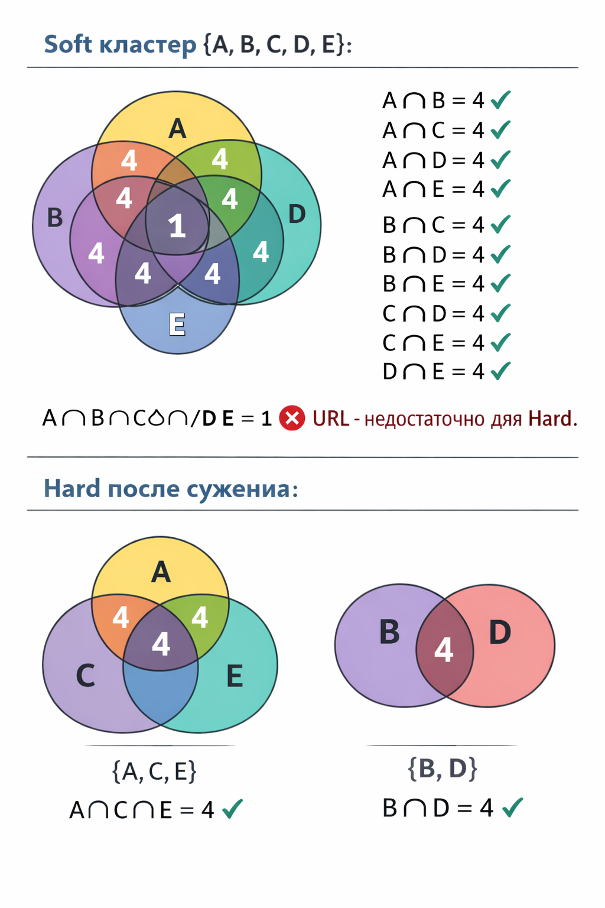

# 🔍 SERP Hard/Soft Clustering Engine v2.2 — Документация

## Оглавление

1. [Общая идея](#1-общая-идея)
2. [Архитектура пайплайна](#2-архитектура-пайплайна)
3. [Soft-кластеризация](#3-soft-кластеризация-попарное-условие)
4. [Hard-кластеризация](#4-hard-кластеризация-глобальное-условие)
5. [Сравнение Soft и Hard](#5-сравнение-soft-и-hard)
6. [Детальное описание каждого шага](#6-детальное-описание-каждого-шага)
7. [Постобработка](#7-постобработка)
8. [Рекомендации по оптимизации](#8-рекомендации-по-оптимизации)

---

## 1. Общая идея

Кластеризация поисковых запросов на основании SERP (Search Engine Results Page) — это метод группировки ключевых слов по **общим URL в поисковой выдаче**. Логика проста: если два запроса возвращают одни и те же URL в ТОП-10, значит поисковая система считает их семантически близкими и их можно продвигать на одной странице.

### Входные данные

| Поле | Описание |
|------|----------|
| `keyword` | Поисковый запрос |
| `url` | URL из ТОП-10 выдачи по этому запросу |

Каждый запрос имеет до 10 URL (параметр `MAX_URLS_PER_KW`).

### Выходные данные

Для каждого запроса — `cluster_id`, показывающий, в какую группу он попал. Запросы внутри одного кластера имеют общие URL в выдаче и могут продвигаться на одной посадочной странице.

---

## 2. Архитектура пайплайна

```
serp.parquet (запрос → URL)
        │
        ▼
┌──────-───────────────────────-┐
│ 1. Загрузка и кодирование     |
| StringEncoder: строки → int   |
│    (38 сек на 7.5M строк)     │
└──────────┬────────────────────┘
           ▼
┌──-----------──────────────────────────────────────┐
│ 2. Построение рёбер                               │
| Inverted index: URL → [запросы]                   |
│    (77 сек)                                       |
|  Пара (A,B) → ребро если |SERP_A ∩ SERP_B| ≥ N    │  
└──────────┬────────────────────────────────────────┘
           ▼
┌───────────────────────────────────────────┐
│ 3. Граф (igraph) 760K вершин, 11M рёбер   |
│    + компоненты связности 185K компонент  |
└──────────┬────────────────────────────────┘
           ▼
┌────────────────────────────┐
│ 4. Поиск клик              │
| K-core split + fast_greedy |
│    (147 сек)               │
| 352K сырых клик            |
└──────┬───────┬─────────────┘
       │       │
       ▼       ▼
┌──────────┐ ┌───────────────────┐
│ SOFT     │ │ HARD              │
│ Попарное │ │ Глобальная        │
│ условие  │ │ проверка + сужение│
│          │ │ (25 мин)          │
└────┬─────┘ └────┬──────────────┘
     ▼            ▼
┌───────────┐  ┌───────────┐
│ Назначение│  │ Назначение│  Жадное: большие клики первыми
│ кластеров │  │ кластеров │
└────┬──────┘  └────┬──────┘
     ▼              ▼
┌──────────┐ ┌──────────┐
│ soft.    │ │ hard.    │
│ parquet  │ │ parquet  │
└──────────┘ └──────────┘
        │         │
        ▼         ▼
┌─────────────────────────┐
│ Merge + постобработка   │  WS-частотность, TOP URL,
│ → Excel                 │  TOP domains, main pages
└─────────────────────────┘
```

---

## 3. Soft-кластеризация (попарное условие)

### Принцип

**Условие:** каждая **пара** запросов в кластере должна иметь ≥ N общих URL.

```
Запрос A ∩ Запрос B ≥ N  ✓
Запрос A ∩ Запрос C ≥ N  ✓
Запрос B ∩ Запрос C ≥ N  ✓
→ {A, B, C} = клика в графе
```

### Как это работает

1. **Граф:** вершины — запросы, ребро между A и B если `|SERP_A ∩ SERP_B| ≥ MIN_COMMON_URLS`
2. **Клики:** ищем максимальные клики — полные подграфы, где каждая вершина связана с каждой
3. **Назначение:** жадно назначаем запросы в кластеры, начиная с самых больших клик

### Особенность

Попарное условие **не гарантирует** общие URL для ВСЕХ запросов одновременно. Пример:

```
A ∩ B = {url1, url2, url3}       — 3 общих ✓
A ∩ C = {url4, url5, url6}       — 3 общих ✓
B ∩ C = {url7, url8, url9}       — 3 общих ✓
A ∩ B ∩ C = {}                    — 0 общих!
```

Все пары удовлетворяют условию, но ни один URL не присутствует во ВСЕХ трёх запросах.

### Результат на данных (760K запросов, MIN_COMMON=4)

- **249,602** кластеров (из них 108,003 мульти)
- Средний размер мульти-кластеа: **5.7** запросов
- Максимальный размер кластера: **1,302** запроса

---

## 4. Hard-кластеризация (глобальное условие)

### Принцип

**Условие:** **ВСЕ** запросы в кластере одновременно должны иметь ≥ N общих URL.

```
Запрос A ∩ Запрос B ∩ Запрос C ≥ N
→ Существует минимум N URL, которые ранжируются в ТОП-10 по ВСЕМ запросам кластера
```

### Как это работает

1. **Фаза 1 (как Soft):** строим граф → ищем клики (попарное условие)
2. **Фаза 2 (глобальная проверка):** для каждой клики вычисляем пересечение URL ВСЕХ запросов:
   - Если `|∩ URL| ≥ N` → клика проходит без изменений ✅
   - Если `|∩ URL| < N` → **сужение**: итеративно убираем «слабый» запрос (тот, чьё удаление максимально увеличивает глобальное пересечение) и повторяем
   - Если после сужения осталось `< MIN_CLIQUE_SIZE` запросов → клика отбрасывается ❌

### Алгоритм сужения клики

```python
while len(clique) >= min_clique_size:
    common = ∩ URL всех запросов в клике
    if |common| >= min_common:
        break  # OK

    # Находим "слабый" запрос
    for каждого запроса kw в клике:
        trial = ∩ URL всех КРОМЕ kw
        если trial > best → запоминаем kw как кандидата на удаление

    удаляем слабый запрос из клики
```

### Зачем нужна Фаза 2?

Клики из Фазы 1 гарантируют только попарное условие. Но для части тематик, где конкуренция за ТОП особенно высока - необходима более строгая кластеризация - когда у всех запросов кластера есть набор обших URL

### Результат на данных

- Из 352,486 сырых клик:
  - **230,468** прошли без изменений
  - **410,085** были сужены (одна клика может дать несколько подклик)
  - **0** отброшены полностью
- Финал: **262,163** кластера (111,856 мульти)
- Средний мульти-кластер: **5.5** запросов
- Общих URL: среднее **5.7**, минимум **4**, максимум **10**

---

## 5. Сравнение Soft и Hard

| Характеристика | Soft (попарное) | Hard (глобальное) |
|---|---|---|
| **Условие** | Каждая пара ≥ N общих URL | ВСЕ запросы ≥ N общих URL |
| **Строгость** | Мягкое | Строгое (Hard ⊂ Soft) |
| **Размер кластеров** | Больше (среднее 5.7) | Меньше (среднее 5.5) |
| **Максимальный кластер** | 1,302 | 1,266 |
| **Гарантия общих URL** | Нет (может быть 0) | Да (≥ N для всех) |
| **Применение** | Широкая группировка тем | Точная проверка |
| **Время** | Быстро | +25 мин на глобальную проверку |
| **Число кластеров** | 249,602 | 262,163 |

### Когда использовать что

**Soft** подходит для:
- Первичной группировки семантики
- Определения тематических направлений
- Когда допустима нечёткая группировка
- При продвижении контент проектеов

**Hard** подходит для:
- Определения конкретных посадочных страниц
- Когда нужна гарантия, что все запросы кластера можно продвинуть одним URL
- Применятеся как правило при продижении по позициямрф

### Визуальное сравнение

```
Soft кластер {A, B, C, D, E}:
  A∩B=4 ✓  A∩C=4 ✓  A∩D=4 ✓  A∩E=4 ✓
  B∩C=4 ✓  B∩D=4 ✓  B∩E=4 ✓
  C∩D=4 ✓  C∩E=4 ✓  D∩E=4 ✓
  Но A∩B∩C∩D∩E = 1 URL — недостаточно для Hard

Hard после сужения:
  {A, C, E} → A∩C∩E = 4 URL ✓
  {B, D}    → B∩D = 4 URL ✓   (отдельный кластер)
```

---

## 6. Детальное описание каждого шага

### 6.1. Конфигурация (Секция 1)

| Параметр | Значение | Описание |
|---|---|---|
| `MIN_COMMON_URLS` | 4 | Минимальное число общих URL для ребра |
| `MAX_URLS_PER_KW` | 10 | Максимум URL на запрос (ТОП-10) |
| `MIN_CLIQUE_SIZE` | 2 | Минимальный размер кластера |
| `DEGENERACY_LIMIT` | 50 | Порог: igraph точный ≤ 50, greedy > 50 |
| `EDGE_METHOD` | inverted_index | Метод построения рёбер |

### 6.2. StringEncoder (Секция 3)

Кодирует строки (запросы и URL) в целые числа для экономии памяти и ускорения операций. Вместо хранения строк в set/dict используются int-идентификаторы.

```
"гостиница москва" → 0
"отель москва"     → 1
"https://booking.com/..." → 0
```

### 6.3. Загрузка данных (Секция 4)

Читает CSV чанками по 500K строк. Для каждого запроса формирует множество URL-идентификаторов (не более `MAX_URLS_PER_KW`). Результат: `kw2urls: Dict[int, Set[int]]`.

### 6.4. Построение рёбер (Секция 5)

**Inverted Index метод:**

1. Строим обратный индекс: `URL → [список запросов]`
2. Для каждого URL перебираем все пары запросов, которые его содержат
3. Считаем число общих URL для каждой пары
4. Оставляем пары с ≥ `MIN_COMMON_URLS` общих

**Sparse Matrix метод** (альтернативный, для >100K запросов):

1. Строим бинарную матрицу `запросы × URL`
2. Умножаем `A × A^T` — получаем матрицу пересечений
3. Фильтруем по порогу

### 6.5. Граф и компоненты (Секция 6)

Строим неориентированный граф в igraph, находим компоненты связности. Каждая компонента обрабатывается независимо — это позволяет параллелизацию и оптимизацию.

Статистика компонент (760K запросов):
- 117,349 одиночных (нет рёбер)
- 57,445 мелких (2-10 вершин)
- Самая большая: 63,449 вершин

### 6.6. Поиск клик v2.2 (Секция 8)

#### Проблема

Поиск всех максимальных клик — NP-hard задача. Сложность `O(d·n·3^(d/3))` где d — degeneracy графа. При d=1327 (наша компонента #1) полный перебор невозможен.

#### Решение: K-core стратификация

1. Вычисляем coreness каждой вершины
2. Разделяем компоненту на **shell** (coreness ≤ 50) и **core** (coreness > 50)
3. Shell → igraph `maximal_cliques()` (точный алгоритм)
4. Core → `fast_greedy_cliques()` (жадная аппроксимация)

#### Fast Greedy Cliques (v2.2)

Ключевые оптимизации по сравнению с v2.1:

1. **Pre-computed adjacency sets**: конвертируем igraph в `Dict[int, Set[int]]` один раз
2. **Pre-sorted seeds**: вершины отсортированы по degree один раз
3. **Candidate pruning**: `remaining &= adj[v]` — при каждом добавлении вершины в клику множество кандидатов сужается

```
Сложность:
  v2.1: O(N² × D) — часы на 114K вершин
  v2.2: O(N × D)  — секунды
```

### 6.7. Глобальная проверка (Секция Hard)

Функция `enforce_global_condition_igraph_iterative`:

- Для каждой сырой клики вычисляет `∩ URL` всех запросов
- Если пересечение < порога — итеративно убирает «слабые» запросы
- Одна клика может породить несколько подклик (через сужение)

Результат: из 352K сырых клик → 640K клик с глобальным условием.

### 6.8. Назначение кластеров (Секция 9-10)

**Жадный эксклюзивный алгоритм:**

1. Сортируем клики по размеру (от больших к маленьким)
2. Для каждой клики:
   - Берём только ещё не назначенные запросы
   - Проверяем, что их ≥ `MIN_CLIQUE_SIZE`
   - (Hard) Пересчитываем глобальное пересечение для оставшихся
   - Назначаем `cluster_id`
3. Все неназначенные запросы → одиночные кластеры

---

## 7. Постобработка

### Merge Soft + Hard

Объединение обоих типов кластеризации по ключевому слову. Позволяет видеть, как запрос группируется в обоих режимах.

### Merge с частотностью (WS)

Присоединение частотности из Wordstat (`sum`) для приоритизации запросов внутри кластера.

### TOP URL по кластеру

Для каждого кластера подсчитывается, сколько раз каждый URL встречается в выдаче запросов кластера. Самый частый URL — лучший кандидат на посадочную страницу.

### Подсчёт морд (main pages)

Определение, сколько главных страниц (домен без пути) ранжируется по запросу. Высокое число морд = навигационный/брендовый интент.

### TOP URL и TOP Domains

Общая аналитика: самые частые URL и домены в SERP-данных.

---

## 8. Рекомендации по оптимизации

### 🔴 Критические (большой эффект)

#### 8.1. Векторизация `get_domain()` и `main_url()`

**Проблема:** `.apply()` по 7.5M строк — это Python-цикл, занимает минуты.

**Решение:**

```python
# Вместо apply + urlparse:

# get_domain — векторизованно
serp['domain'] = serp['url'].str.extract(r'https?://([^/:]+)', expand=False)

# main_url — векторизованно
parsed = serp['url'].str.extract(r'https?://[^/]+(.*)', expand=False).fillna('/')
serp['main_page'] = (parsed.isin(['', '/'])).astype(int)
```

**Ускорение:** ~50-100x (минуты → секунды).

#### 8.2. Cap на URL в inverted index

**Проблема:** URL `yandex.ru/...` встречается в 462K запросах. Перебор всех пар = C(462K, 2) ≈ 107 млрд операций для одного URL.

Текущий код уже сортирует по числу запросов и отрабатывает это, но явный cap ускорит и улучшит качество — слишком общие URL неинформативны (как стоп-слова):

```python
MAX_KW_PER_URL = 5000  # настраиваемый порог

for url_id, kw_list in url2kws.items():
    if len(kw_list) > MAX_KW_PER_URL:
        continue  # слишком общий URL, пропускаем
    # ... обработка пар
```

#### 8.3. Баг в валидации

**Проблема:** вывод валидации показывает `"все ≥3"`, хотя `MIN_COMMON_URLS=4`. Функция принимает `min_common` параметром, но строка вывода фиксирована из прошлого рана. Убедитесь, что при каждом запуске передаётся актуальное значение.

### 🟡 Важные (среднее ускорение)

#### 8.4. Финальный Excel-экспорт

**Проблема:** запись 760K строк + несколько листов в Excel — медленно и файл тяжёлый.

**Решение:**

```python
# Основной результат → parquet (быстро, компактно)
result.to_parquet('hotel_4_hard.parquet', index=False)

# Аналитику (top_urls, top_domains) → отдельные parquet
url_count_by_category.to_parquet('url_count_by_category.parquet')
top_urls.to_parquet('top_urls.parquet')
top_domains.to_parquet('top_domains.parquet')

# Если нужен Excel для менеджеров — сэмплить или агрегировать
```

#### 8.5. Параллельная глобальная проверка

**Проблема:** `enforce_global_condition` — 25 минут последовательно.

**Решение:** клики независимы друг от друга, можно обрабатывать батчами в `ProcessPoolExecutor`:

```python
from concurrent.futures import ProcessPoolExecutor

def process_clique_batch(batch, kw2urls, min_common, min_size):
    results = []
    for clique in batch:
        # ... enforce logic
        results.append(...)
    return results

batches = [cliques[i:i+1000] for i in range(0, len(cliques), 1000)]
with ProcessPoolExecutor(max_workers=NUM_WORKERS) as pool:
    futures = [pool.submit(process_clique_batch, b, kw2urls, ...) for b in batches]
```

#### 8.6. Чтение SERP из parquet вместо CSV

Загрузка идёт через `load_serp_csv()` (секция 4), хотя данные уже сохранены в `serp_data.parquet`. Можно написать `load_serp_parquet()` — будет быстрее в 3-5 раз и не нужна промежуточная CSV-конвертация.

### 🟢 Мелкие улучшения

#### 8.7. Нормализация `common_urls` в экспорте

Колонка `common_urls` содержит длинные строки с `" | "` разделителем. Для больших кластеров эта строка дублируется сотни раз. Варианты:

- Хранить `common_urls` в отдельной таблице `cluster_id → urls`
- Или использовать `list` тип в parquet (pyarrow поддерживает)

#### 8.8. Пустые ячейки в ноутбуке

Несколько пустых code-ячеек и неиспользуемый код — стоит почистить для читаемости.

#### 8.9. Управление памятью

После загрузки SERP в постобработке в памяти одновременно находятся: `kw2urls`, `G` (граф), `raw_cliques_kw`, `cliques_global`, `kw2cluster`, `result_df`, `serp`, `merged_df`. На 760K запросов это 10-15 GB. Рекомендуется освобождать промежуточные структуры:

```python
del G, kw2vertex, vertex2kw, components
del raw_cliques_kw, cliques_global
gc.collect()
# ... потом загружаем serp для постобработки
```

---

## Приложение: Параметры масштабирования

| Метрика | Значение |
|---|---|
| Запросов | 760,992 |
| URL в SERP | 2,417,211 |
| Строк SERP | 7,550,791 |
| Рёбер в графе | 10,971,176 |
| Сырых клик | 352,486 |
| Hard-кластеров | 262,163 (111,856 мульти) |
| Soft-кластеров | 249,602 (108,003 мульти) |
| Общее время (без постобработки) | ~30 мин |
| Пиковая RAM | ~12-15 GB |

